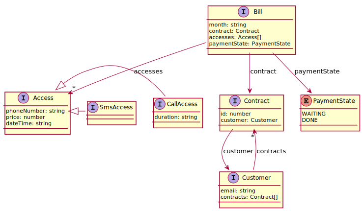

# livingdoc-typescript-plugin

Living documentation plugin for typescript.

[](https://www.npmjs.com/package/livingdoc-typescript-plugin)
[](https://travis-ci.org/jboz/livingdoc-typescript-plugin)
[](https://github.com/feross/standard)

## Usage

### Install

```shell
npm install --global livingdoc
```

### No installation

```shell
npx livingdoc ...
```

### Generate classes diagram

```bash
livingdoc-typescript-plugin diagram -i src\domain\**\*.ts -o dist\domain-classes.svg
```

Result example :


### Generate glossary

```bash
livingdoc-typescript-plugin glossary -i src\domain\**\*.ts -o dist\glossary.md
```

Result example :

| ObjectName   | Attribute name | Type         | Description                                                            |
| ------------ | -------------- | ------------ | ---------------------------------------------------------------------- |
| Access       |                |              |                                                                        |
|              | phoneNumber    | string       |                                                                        |
|              | price          | number       |                                                                        |
|              | dateTime       | string       |                                                                        |
| Bill         |                |              | Monthly bill.                                                          |
|              | month          | string       | Which month of the bill.                                               |
|              | contract       | Contract     | Contract concerned by the bill.                                        |
|              | accesses       | Access[]     | Bill contents.                                                         |
|              | paymentState   | PaymentState | Bill payment state                                                     |
| CallAccess   |                |              |                                                                        |
|              | duration       | string       |                                                                        |
| Contract     |                |              | Telecom contract                                                       |
|              | id             | number       | Contract identifier. Generate by the system and communicate to client. |
|              | customer       | Customer     | Contract customer.                                                     |
| Customer     |                |              | Customer of the telecom service                                        |
|              | email          | string       | Email of the customer.                                                 |
|              | contracts      | Contract[]   | Customer's contracts.                                                  |
| PaymentState |                | Enumeration  | Bill payment state values.                                             |
|              | WAITING        |              | Wainting payment by the client.                                        |
|              | DONE           |              | Client has payed.                                                      |
| SmsAccess    |                |              |                                                                        |

## Options

### -i, --input <path>

    Define the path of the Typescript file

### -o, --output <path>

    Define the path of the output file. If not defined, it'll output on the STDOUT

### -d, --deep <boolean>

    Indicate if program must through dependancies content or not
