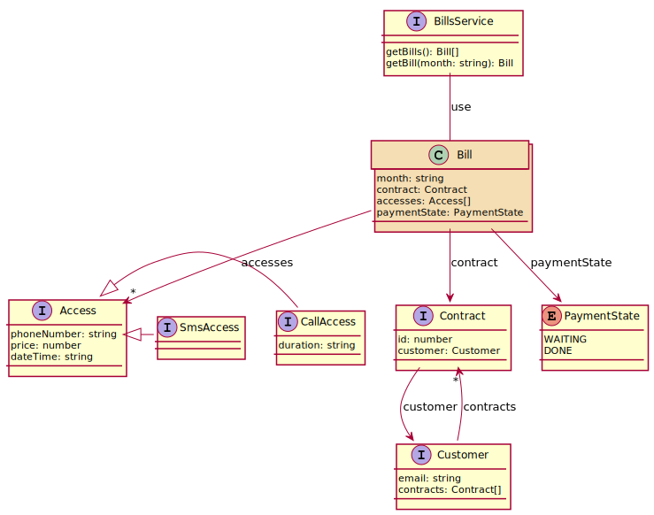

# livingdoc-typescript-plugin

Living documentation plugin for typescript.

[](https://www.npmjs.com/package/livingdoc-typescript-plugin)
[](https://travis-ci.org/jboz/livingdoc-typescript-plugin)
[](https://github.com/feross/standard)

## Usage

### Install

```shell
npm install --global livingdoc
```

### No installation

```shell
npx livingdoc ...
```

### Generate classes diagram

```bash
livingdoc -i src\domain\**\*.ts -o dist\domain-classes.svg
```

Result example :


## Options

### -i, --input <path>

    Define the path of the Typescript file

### -o, --output <path>

    Define the path of the output file. If not defined, it'll output on the STDOUT

### -d, --deep <boolean>

    Indicate if program must through dependancies content or not
